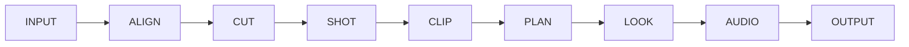
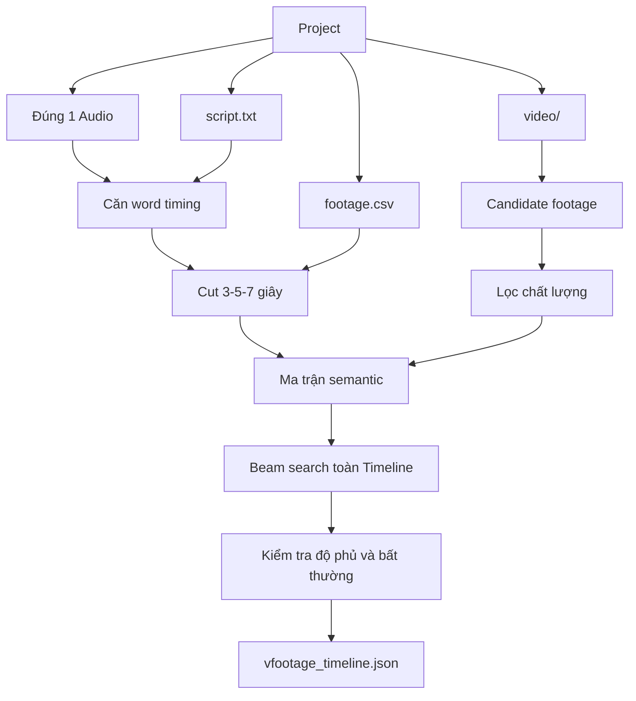
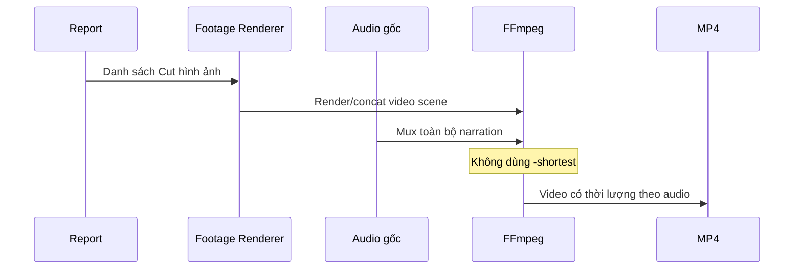

# Kiến trúc và sơ đồ hoạt động

## Kiến trúc module

| Module | Trách nhiệm |
|---|---|
| `inputs.py` | Nạp một audio, script, Beat và footage |
| `alignment.py` | Căn từ trong script với audio |
| `segmentation.py` | Chia lời thoại thành Cut |
| `scene_candidates.py` | Phát hiện scene và tạo cửa sổ ứng viên |
| `quality_scoring.py` | Lọc kỹ thuật và chấm model thị giác |
| `source_coverage.py` | Đo nguồn footage theo Beat |
| `optimization.py` | Tối ưu lựa chọn toàn Timeline |
| `effects.py` | Scale, transition, color và giữ khung cuối |
| `output.py` | Report, render và xuất scene |
| `low_memory_render.py` | Render từng scene rồi mux nguyên audio |
| `capcut_export/` | Gói scene, narration, caption và Draft CapCut |
| `ui/main_window.py` | Workflow, bảng Beat và cảnh báo tương tác |

## Pipeline chín Stage



| Stage | Chức năng |
|---|---|
| INPUT | Audio, transcript, Beat và kho footage |
| ALIGN | Căn lời thoại với audio |
| CUT | Chia lời theo Min/Target/Max |
| SHOT | Phát hiện scene và Candidate |
| CLIP | Lọc chất lượng và chấm nội dung |
| PLAN | Tối ưu toàn bộ Timeline |
| LOOK | Transition, animation và color |
| AUDIO | Gắn nguyên audio lời thoại |
| OUTPUT | Xuất MP4, report hoặc CapCut |

## Luồng phân tích



## Luồng render không cắt audio



## Dữ liệu report

Report chính:

```text
project/.cache/vfootage_timeline.json
```

Chứa:

- Thông tin đầu vào.
- Word timing.
- Timeline Cut.
- Footage và khoảng nguồn.
- Điểm semantic/chất lượng.
- Cảnh báo nguồn.
- Tổng điểm tối ưu.

## CapCut

Gói CapCut:

```text
capcut_package/
├── scenes/
├── narration.wav
├── captions.srt
├── capcut_manifest.json
└── README_CAPCUT.txt
```

Audio trong Draft là `narration.wav` duy nhất, bắt đầu tại `00:00:00`.

