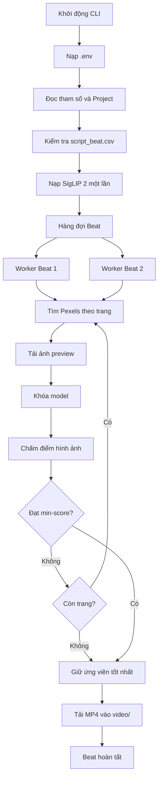
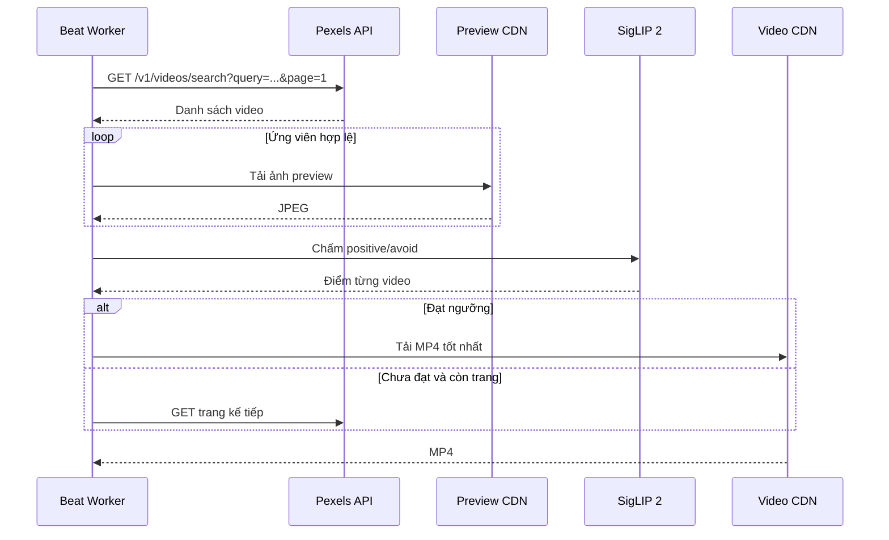

# Kiến trúc và sơ đồ hoạt động

## Thành phần

| Thành phần | Trách nhiệm |
|---|---|
| `load_env_file` | Nạp API key từ `.env` |
| `load_rows` | Đọc và kiểm tra cấu trúc `script_beat.csv` |
| `search_query` | Lấy cụm từ khóa chính cho Pexels |
| `positive_prompt` | Tạo prompt chấm điểm từ CSV |
| `search_best_video` | Gọi API, phân trang và dừng sớm |
| `VisualScorer` | Tải preview và chấm bằng SigLIP 2 |
| `technical_bonus` | Chấm độ phân giải và thời lượng |
| `download_video` | Tải streaming vào file `.part`, sau đó đổi tên |
| `ThreadPoolExecutor` | Chạy nhiều Beat đồng thời |

## Luồng tổng thể



## Trình tự xử lý một Beat



## Cấu trúc dữ liệu

Các cột CSV bắt buộc:

```text
ma_beat,tu_khoa,hinh_can_tim,tranh
```

`y_chinh` không bắt buộc ở bước kiểm tra CSV nhưng được dùng để tăng chất lượng
prompt nếu có.

Tên file đầu ra:

```text
<MA_BEAT>_PEXELS_<VIDEO_ID>.mp4
```

Ví dụ:

```text
H31_PEXELS_27255641.mp4
```

File được ghi trước dưới đuôi `.part`. Chỉ khi tải thành công file mới được đổi
thành `.mp4`, tránh để lại video hỏng mang tên hoàn chỉnh.

